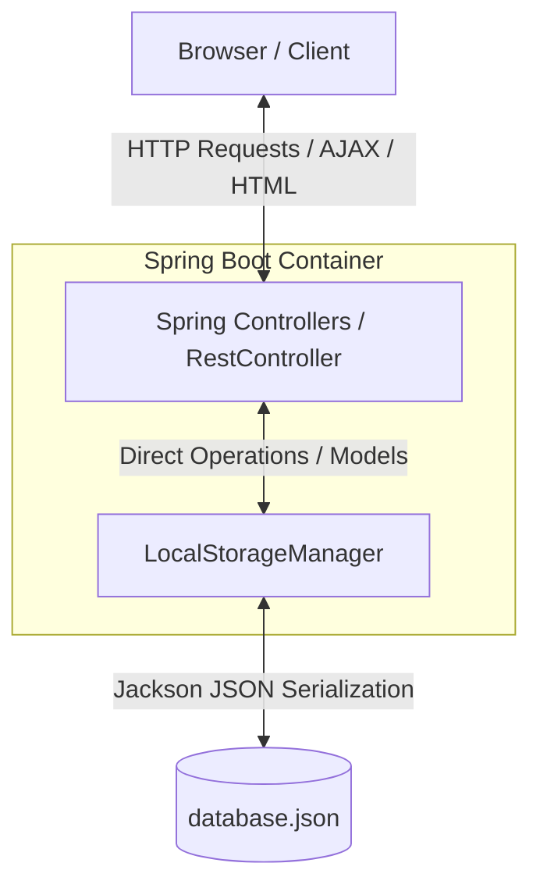
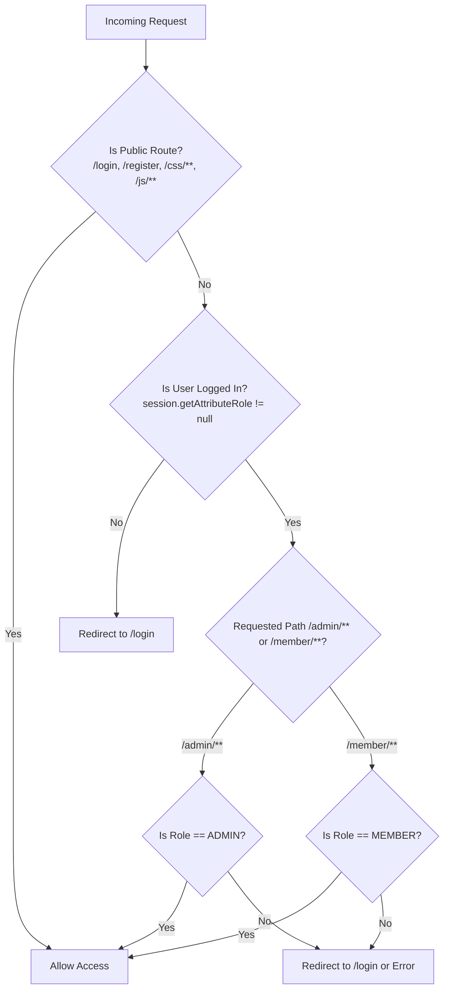
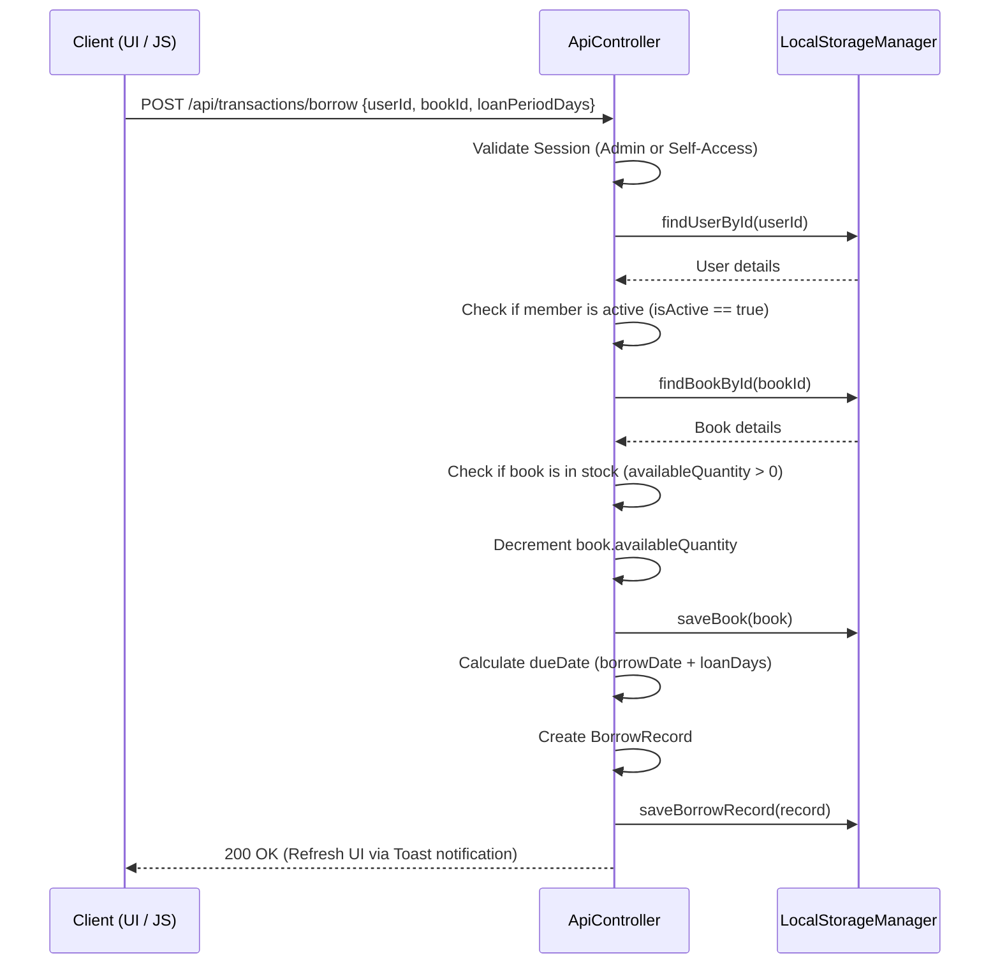
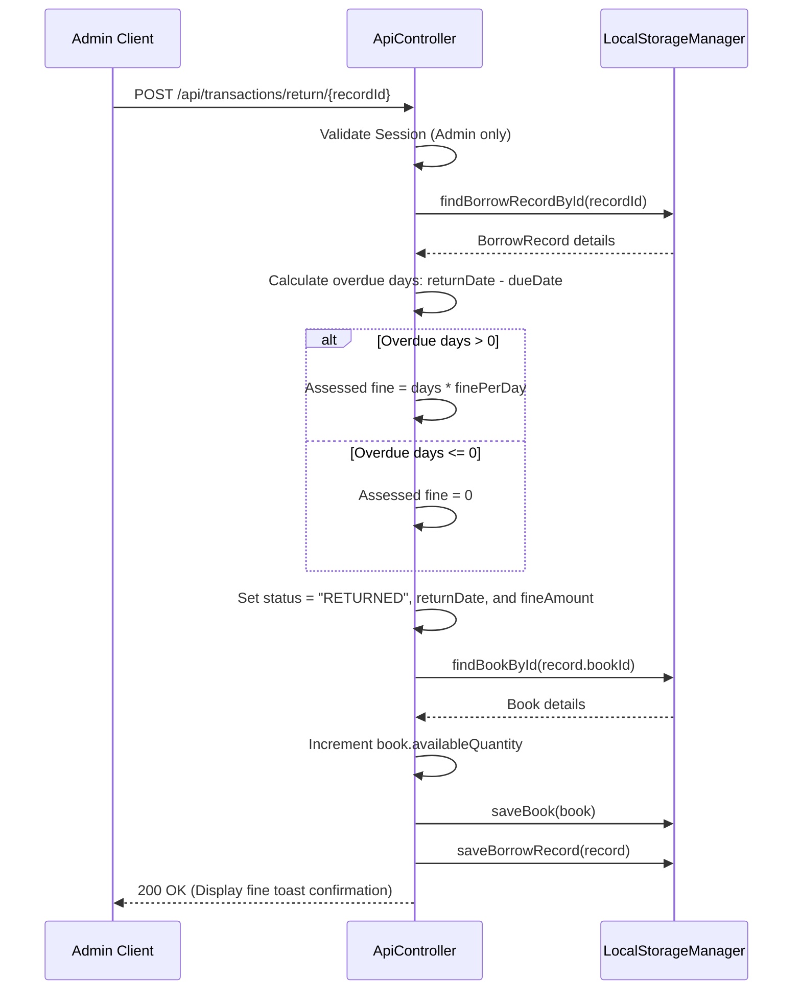

# 📚 LibManage — Premium Library Management System

A robust, modern, and lightweight Library Management System (LMS) built with **Spring Boot 3.3.4**, **Java 17**, and **Thymeleaf**. Featuring a highly responsive custom-styled frontend, thread-safe JSON-based local database storage, and a custom session security model.

---

## 🗺️ System Architecture

LibManage is structured as a streamlined monolithic MVC application utilizing Spring Boot's dependency injection container, custom-built local JSON database storage, and an interactive front-end rendered using Thymeleaf, Bootstrap 5.3, custom CSS styling, and Chart.js.

### High-Level Component Flow



---

## 📂 Project Structure

Here is a full breakdown of the files and directories inside the project. Click on any file to open it directly in your IDE:

*   📂 **`src/main/java/com/libmanage/`**
    *   📄 [LibManageApplication.java](src/main/java/com/libmanage/LibManageApplication.java): Main entry point for the Spring Boot application.
    *   📂 **`controller/`**
        *   📄 [AdminController.java](src/main/java/com/libmanage/controller/AdminController.java): Serves Thymeleaf view templates for the administrator dashboard, catalog, member lists, and checkouts.
        *   📄 [ApiController.java](src/main/java/com/libmanage/controller/ApiController.java): Exposes REST APIs for book search, CRUD operations, member block/unblock, borrowing, returns, and leaderboard statistics.
        *   📄 [AuthController.java](src/main/java/com/libmanage/controller/AuthController.java): Manages registration forms, custom session-based login/logout configurations, and credentials validation.
        *   📄 [BookController.java](src/main/java/com/libmanage/controller/BookController.java): Handles book deletion actions for administrators.
        *   📄 [CustomErrorController.java](src/main/java/com/libmanage/controller/CustomErrorController.java): Integrates custom error pages for `403 Forbidden`, `404 Not Found`, and generic server errors.
        *   📄 [GlobalControllerAdvice.java](src/main/java/com/libmanage/controller/GlobalControllerAdvice.java): Injects request URI metadata globally into all Thymeleaf views.
        *   📄 [MemberController.java](src/main/java/com/libmanage/controller/MemberController.java): Serves member portal views showing active borrows, due dates, and borrow history.
        *   📄 [MemberDeleteController.java](src/main/java/com/libmanage/controller/MemberDeleteController.java): Handles member account deletions for administrators.
    *   📂 **`model/`**
        *   📄 [Book.java](src/main/java/com/libmanage/model/Book.java): Model representing book properties (ISBN, title, author, total and available quantities, cover image, and shelf location).
        *   📄 [BorrowRecord.java](src/main/java/com/libmanage/model/BorrowRecord.java): Model tracking borrow transactions, due dates, return dates, and calculated overdue fines.
        *   📄 [User.java](src/main/java/com/libmanage/model/User.java): Model tracking credentials, roles (`ADMIN` or `MEMBER`), and active account status.
    *   📂 **`storage/`**
        *   📄 [LocalStorageManager.java](src/main/java/com/libmanage/storage/LocalStorageManager.java): Core thread-safe data access layer managing the local JSON database file.
*   📂 **`src/main/resources/`**
    *   📄 [application.properties](src/main/resources/application.properties): Project configuration containing port definitions, loan durations, and fine schedules.
    *   📂 **`static/`**
        *   📂 **`css/`**
            *   📄 [style.css](src/main/resources/static/css/style.css): Custom design framework using CSS variables, typography headers, and specific UI card overlays.
        *   📂 **`js/`**
            *   📄 [main.js](src/main/resources/static/js/main.js): Powers client-side AJAX calls, modal forms, search debouncing, and Chart.js animations.
    *   📂 **`templates/`**
        *   📄 [login.html](src/main/resources/templates/login.html): Login panel featuring interactive credentials lists and input validation.
        *   📄 [register.html](src/main/resources/templates/register.html): Portal for enrolling new member accounts with character validation rules.
        *   📂 **`admin/`**
            *   📄 [dashboard.html](src/main/resources/templates/admin/dashboard.html): Administrator home screen showing metric panels, active checkouts, and leaderboard figures.
            *   📄 [books.html](src/main/resources/templates/admin/books.html): Catalog management workspace with add/edit slide drawers and full metadata controls.
            *   📄 [members.html](src/main/resources/templates/admin/members.html): Directory for managing member accounts, viewing active logs, and toggling block/unblock states.
            *   📄 [transactions.html](src/main/resources/templates/admin/transactions.html): Checkout console featuring live member searches and borrow logs.
        *   📂 **`member/`**
            *   📄 [dashboard.html](src/main/resources/templates/member/dashboard.html): Main hub allowing self-borrowing, book catalog searches, and active loan trackers.
            *   📄 [my-books.html](src/main/resources/templates/member/my-books.html): Personal history board displaying past checkouts, returned dates, and assessed fines.
        *   📂 **`fragments/`**
            *   📄 [navbar.html](src/main/resources/templates/fragments/navbar.html): Shared navigation template with role-based visibility rules.
            *   📄 [footer.html](src/main/resources/templates/fragments/footer.html): Standard footer.
        *   📂 **`error/`**
            *   📄 [403.html](src/main/resources/templates/error/403.html), [404.html](src/main/resources/templates/error/404.html), [general.html](src/main/resources/templates/error/general.html): Specially designed status-oriented error pages.

---

## 🛢️ Database Schema & Data Models

Instead of relying on heavy external database engines, LibManage utilizes a lightweight, file-based database schema stored directly in [database.json](database.json). Data serialization and deserialization are handled by a customized Jackson `ObjectMapper` with support for Java Time modules.

All read and write actions are fully synchronized to ensure thread safety across simultaneous client requests.

### 1. User Model
Represents administrators and registered library members.
*   **Java Class**: [User.java](src/main/java/com/libmanage/model/User.java)
*   **Attributes**:
    *   `id` (String - UUID)
    *   `fullName` (String - Required)
    *   `email` (String - Required, Case-insensitive match)
    *   `password` (String - Plain text)
    *   `role` (String - Defaults to `"MEMBER"`. Can be `"ADMIN"`)
    *   `active` (boolean - Defaults to `true`. Determines block status)
    *   `createdAt` (LocalDateTime)

### 2. Book Model
Holds book metadata and handles live stock tracking.
*   **Java Class**: [Book.java](src/main/java/com/libmanage/model/Book.java)
*   **Attributes**:
    *   `id` (String - UUID)
    *   `title` (String - Required)
    *   `author` (String - Required)
    *   `isbn` (String - Required, Unique)
    *   `totalQuantity` (int - minimum `0`)
    *   `availableQuantity` (int - minimum `0`. Incremented/decremented on return and checkout)
    *   `coverImageUrl` (String - URL pointing to cover image or a default placeholder)
    *   `shelfLocation` (String - Location coordinates in the library)
    *   `description` (String - Summary of the book)
    *   `createdAt` (LocalDateTime)

### 3. Borrow Record Model
Tracks checkout histories, due dates, return timestamps, and outstanding fines.
*   **Java Class**: [BorrowRecord.java](src/main/java/com/libmanage/model/BorrowRecord.java)
*   **Attributes**:
    *   `id` (String - UUID)
    *   `userId` (String - Reference to User id)
    *   `bookId` (String - Reference to Book id)
    *   `borrowDate` (LocalDateTime - Defaults to current time)
    *   `dueDate` (LocalDateTime)
    *   `returnDate` (LocalDateTime - Populated upon return)
    *   `fineAmount` (BigDecimal - Defaults to `0` or calculated based on overdue days)
    *   `status` (String - `"BORROWED"` or `"RETURNED"`)
    *   **Transient properties** (Populated at runtime for UI rendering; not persisted in JSON):
        *   `bookTitle`, `bookAuthor`, `bookCoverImageUrl`, `memberName`, `memberEmail`

---

## 🔒 Custom Security Model

To maximize performance and keep setup trivial, LibManage implements a **Custom Session-Based Authorization Model** utilizing standard `HttpSession` attributes. This avoids the overhead and configuration complexity of Spring Security while ensuring secure, role-restricted access.

### Route Access Control Flow



### Authorization Mechanics
1.  **Session Injection**: Upon successful login, the user's ID, full name, and role are injected into the HTTP session (`session.setAttribute("role", user.getRole())`).
2.  **Role Verification**: Every controller mapping under `/admin` or `/member` and secure REST endpoints under `/api` perform a quick session role inspection. If unauthorized, they redirect to the login page or return a `403 Forbidden` response.
3.  **Member Block Handling**: Before permitting login, the system checks the user's `active` property. If `active` is `false`, the request is rejected, redirecting the user to `/login?blocked=true` to display an administrative notice.

---

## ⚙️ Business Rules & Processing Flows

Core business parameters can be adjusted directly within [application.properties](src/main/resources/application.properties):
*   `libmanage.loan.period-days`: Default lending period (Default: `14` days).
*   `libmanage.fine.per-day`: Overdue fine assessed per day (Default: ₹`5`).

---

### 📥 1. Borrowing Workflow

Both members (self-borrowing via their catalog dashboard) and administrators (issuing a book directly to a member under the **Transactions** view) can initiate checkouts.



---

### 📤 2. Return Workflow

Returns are processed by an Administrator. During a return, overdue fines are calculated, book stock is restored, and the transaction is finalized.



---

### 📊 3. Dashboard Leaderboard Logic

The leaderboards utilize Java Streams to group, sort, and slice transaction data in memory:
1.  **Grouping**: Group all transactions in the `borrowRecords` list by `bookId` and calculate the count of records for each group.
2.  **Sorting**: Sort descending by the count of records (`borrowCount`).
3.  **Limiting**: Restrict results to the top `5` most checked-out items.
4.  **Resolution**: The pipeline runs dynamically, maps the top records to detailed book entities, and passes them to the frontend where they are plotted in an elegant Chart.js bar chart.

---

## 🎨 UI, CSS Variables & Frontend Features

The frontend interface features a modern dark sidebar layout, rounded design accents, and specific styling treatments to provide a premium user experience.

### 🎨 Visual Theme Tokens
Defined in [style.css](src/main/resources/static/css/style.css):
*   **Navy** (`--lm-navy: #1A365D`, `--lm-navy-dark: #122845`): Anchors headers, layouts, primary action buttons, and form labels.
*   **Cyan** (`--lm-cyan: #38B2AC`): Focus color, highlights active navigation indicators, and markers.
*   **Amber** (`--lm-amber: #D69E2E`): Warns about overdue states and accounts with alerts.
*   **Red** (`--lm-red: #E53E3E`): Highlights warning prompts and block buttons.
*   **Light Gray** (`--lm-bg: #F7FAFC`): Base container background canvas.
*   **Typography**: Combines *Source Serif 4* for elegant displays with *Inter* for readable UI text, and *IBM Plex Mono* for due dates and currency figures.

### 📳 Interactive Dynamic Behaviors
All interactions are managed in [main.js](src/main/resources/static/js/main.js):
*   **Debounced Catalog Search**: Triggers AJAX requests to `/api/books/search?q=...` 300ms after user input stops to avoid overloading the application.
*   **Perforated Library Motif**: Card list components use a specific dashed pattern (`.lm-card-stub`) resembling stamped card pockets to display due dates.
*   **Dynamic Toast Notifications**: Displays custom status messages in dynamic toast panels. Overdue return confirmations specify assessed fines (e.g. `Book returned. Fine: ₹15.00`).

---

## 🌐 REST API Reference

All requests and responses use JSON payloads, except for book creations and updates which utilize multi-part forms for image uploads.

### Books API
| Endpoint | Method | Content-Type | Parameters / Body | Description |
| :--- | :--- | :--- | :--- | :--- |
| `/api/books/search` | `GET` | — | `q` (Optional query string) | Returns matching books list. |
| `/api/books` | `POST` | `multipart/form-data` | Form parameters: `title`, `author`, `isbn`, `totalQuantity`, `shelfLocation`, `description` | Creates a book. `availableQuantity` defaults to `totalQuantity`. |
| `/api/books/{id}` | `PUT` | `multipart/form-data` | Form parameters: same as POST | Updates book details. Adjusts available quantity accordingly. |
| `/api/books/{id}` | `DELETE`| — | — | Deletes a book and removes its associated borrowing records. |

### Members API
| Endpoint | Method | Parameters / Body | Description |
| :--- | :--- | :--- | :--- |
| `/api/members/search` | `GET` | `q` (Optional query string) | Returns all members or filters list by name/email matches. |
| `/api/members` | `POST` | `application/json` | `{"fullName": "string", "email": "string", "password": "string"}` | Creates a new member account. |
| `/api/members/{id}/block`| `POST` | `active` (boolean query parameter) | Sets member block status (`true` to unblock, `false` to block). |

### Transactions & Leaderboard API
| Endpoint | Method | Content-Type | Body Format | Description |
| :--- | :--- | :--- | :--- | :--- |
| `/api/transactions/borrow` | `POST` | `application/json` | `{"userId": "string", "bookId": "string", "loanPeriodDays": "string"}` | Creates a borrowing record. |
| `/api/transactions/return/{recordId}` | `POST` | — | — | Returns a book, updates quantities, and outputs computed fines. |
| `/api/leaderboard` | `GET` | — | — | Returns top 5 books sorted by checkout counts. |

---

## 🛠️ Step-by-Step Run & Setup Guide

### 📋 Prerequisites
1.  **JDK 17 or 21**: Make sure your local path variable points to the correct version (`java -version`).
2.  **Maven 3.6+**: Confirm that Maven tools are accessible (`mvn -version`).

### 🚀 Launch Steps
1.  **Build Code**: Download and package resources using Maven:
    ```bash
    mvn clean install
    ```
2.  **Run Application**: Launch using the Spring Boot Maven plugin:
    ```bash
    mvn spring-boot:run
    ```
3.  **Access Web Panel**: Open **[http://localhost:8080](http://localhost:8080)** on any browser. You will be redirected to the login panel.

---

### 🔑 Seeding Administrator & Test Credentials

On initial launch, if `database.json` is not present, the system automatically creates the file and seeds default administrative and member credentials:

#### 1. Administrator Account
*   **Role**: `ADMIN` (Can configure catalog, view transaction lists, and register or block member accounts)
*   **Login Email**: `admin@lib.com`
*   **Login Password**: `admin123`

#### 2. Test Member Account
*   **Role**: `MEMBER` (Can browse the catalog, self-borrow books, view due dates, and track personal return logs)
*   **Login Email**: `member@lib.com`
*   **Login Password**: `member123`

---

## 🐳 Running with Docker

You can containerize the application easily using the provided multi-stage `Dockerfile`.

1.  **Build the Docker Image**:
    ```bash
    docker build -t libmanage .
    ```
2.  **Run the Container**:
    ```bash
    docker run -p 8080:8080 libmanage
    ```
    *Note: If you want to persist the database file (`database.json`) outside the container, you can mount it as a volume:*
    ```bash
    docker run -p 8080:8080 -v ${PWD}/database.json:/app/database.json libmanage
    ```
