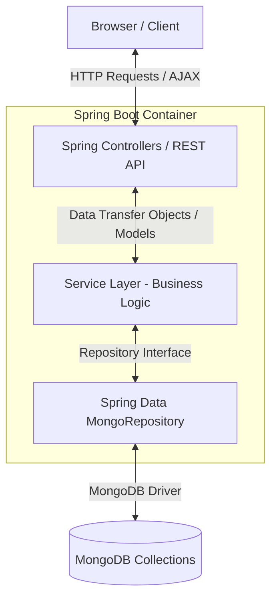
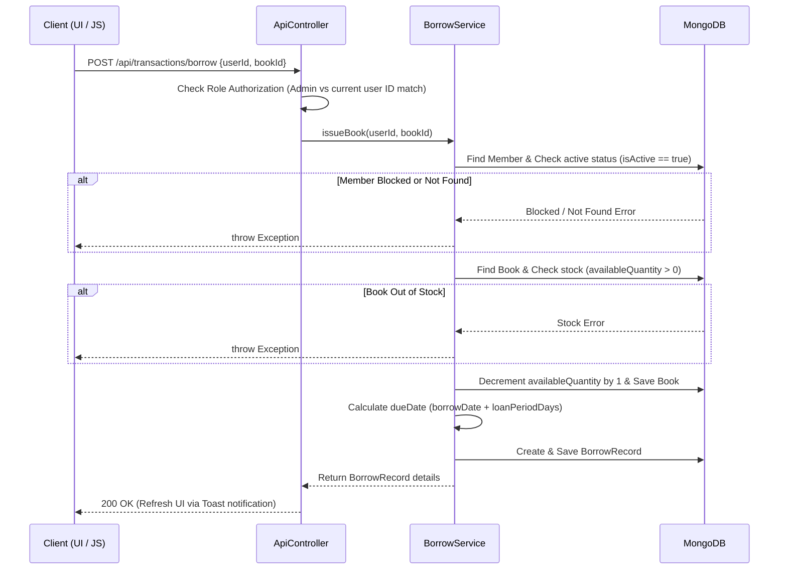
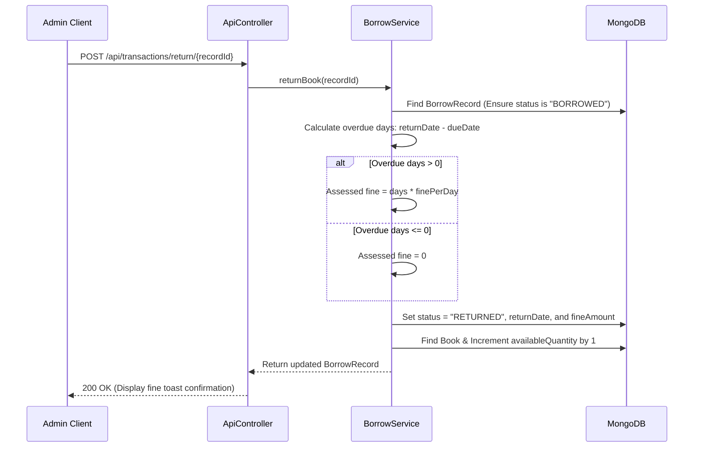

# LibManage — Premium Library Management System

A robust, modern Library Management System (LMS) built with **Spring Boot 3.3**, **MongoDB**, and **Spring Security 6**. Designed with clean architecture patterns, rich responsive UI, and custom administrative controls.

---

## 🗺️ System Architecture

LibManage is structured as a monolithic MVC application utilizing Spring Boot's dependency injection container, database repositories built with Spring Data MongoDB, and an interactive front-end rendered using Thymeleaf, Bootstrap 5.3, and Chart.js.

### High-Level Component Flow


---

## 📂 Project Structure

Here is a full breakdown of the files and directories inside the project:

*   📂 **`src/main/java/com/libmanage/`**
    *   📄 [LibManageApplication.java](file:///c:/Users/LENOVO/Downloads/libmanage/libmanage/src/main/java/com/libmanage/LibManageApplication.java): Main entry point for the Spring Boot application.
    *   📂 **`config/`**
        *   📄 [DataSeeder.java](file:///c:/Users/LENOVO/Downloads/libmanage/libmanage/src/main/java/com/libmanage/config/DataSeeder.java): Seeds the default admin account on initial system startup.
        *   📄 [SecurityConfig.java](file:///c:/Users/LENOVO/Downloads/libmanage/libmanage/src/main/java/com/libmanage/config/SecurityConfig.java): Configures BCrypt password hashing, session policies, authentication managers, and role-based path security rules.
        *   📄 [WebConfig.java](file:///c:/Users/LENOVO/Downloads/libmanage/libmanage/src/main/java/com/libmanage/config/WebConfig.java): Configures resource handlers to serve dynamic uploaded cover images from the local file system.
    *   📂 **`controller/`**
        *   📄 [AdminController.java](file:///c:/Users/LENOVO/Downloads/libmanage/libmanage/src/main/java/com/libmanage/controller/AdminController.java): Serves Thymeleaf dashboard view templates for the administrator interface.
        *   📄 [ApiController.java](file:///c:/Users/LENOVO/Downloads/libmanage/libmanage/src/main/java/com/libmanage/controller/ApiController.java): Exposes REST APIs for book search, CRUD operations, member block/unblock, borrowing, returns, and leaderboard statistics.
        *   📄 [AuthController.java](file:///c:/Users/LENOVO/Downloads/libmanage/libmanage/src/main/java/com/libmanage/controller/AuthController.java): Manages registration forms, routing for custom login/logout configurations, and custom error validations.
        *   📄 [CustomErrorController.java](file:///c:/Users/LENOVO/Downloads/libmanage/libmanage/src/main/java/com/libmanage/controller/CustomErrorController.java): Integrates custom error pages for `403 Forbidden`, `404 Not Found`, and generic server errors.
        *   📄 [MemberController.java](file:///c:/Users/LENOVO/Downloads/libmanage/libmanage/src/main/java/com/libmanage/controller/MemberController.java): Serves views showing borrowed books and borrowing history for currently authenticated members.
    *   📂 **`model/`**
        *   📄 [Book.java](file:///c:/Users/LENOVO/Downloads/libmanage/libmanage/src/main/java/com/libmanage/model/Book.java): Database model representing book properties (ISBN, title, author, quantity tracker).
        *   📄 [BorrowRecord.java](file:///c:/Users/LENOVO/Downloads/libmanage/libmanage/src/main/java/com/libmanage/model/BorrowRecord.java): Database model for transactions. Includes transient variables for Thymeleaf rendering.
        *   📄 [User.java](file:///c:/Users/LENOVO/Downloads/libmanage/libmanage/src/main/java/com/libmanage/model/User.java): Model tracking admin credentials and registered members.
    *   📂 **`repository/`**
        *   📄 [BookRepository.java](file:///c:/Users/LENOVO/Downloads/libmanage/libmanage/src/main/java/com/libmanage/repository/BookRepository.java): Declares queries for ISBN validation and full-text search filters.
        *   📄 [BorrowRecordRepository.java](file:///c:/Users/LENOVO/Downloads/libmanage/libmanage/src/main/java/com/libmanage/repository/BorrowRecordRepository.java): Aggregates transactions by member ID, status, and due date limits.
        *   📄 [UserRepository.java](file:///c:/Users/LENOVO/Downloads/libmanage/libmanage/src/main/java/com/libmanage/repository/UserRepository.java): Validates unique email inputs and filters lists by active roles.
    *   📂 **`service/`**
        *   📄 [BookService.java](file:///c:/Users/LENOVO/Downloads/libmanage/libmanage/src/main/java/com/libmanage/service/BookService.java): Coordinates book catalog creations, file cleanup on catalog deletions, and dynamic quantity recalibrations.
        *   📄 [BorrowService.java](file:///c:/Users/LENOVO/Downloads/libmanage/libmanage/src/main/java/com/libmanage/service/BorrowService.java): Runs logic for book issuance checks, inventory adjustments, and overdue fine evaluations.
        *   📄 [CustomUserDetailsService.java](file:///c:/Users/LENOVO/Downloads/libmanage/libmanage/src/main/java/com/libmanage/service/CustomUserDetailsService.java): Integrates Spring Security's authorization details directly with the User document.
        *   📄 [LeaderboardService.java](file:///c:/Users/LENOVO/Downloads/libmanage/libmanage/src/main/java/com/libmanage/service/LeaderboardService.java): Evaluates aggregate rankings using custom MongoDB aggregation pipelines.
        *   📄 [UserService.java](file:///c:/Users/LENOVO/Downloads/libmanage/libmanage/src/main/java/com/libmanage/service/UserService.java): Exposes member enrollment controls, blocking switches, and admin bootstrap tools.
    *   📂 **`util/`**
        *   📄 [FileUploadUtil.java](file:///c:/Users/LENOVO/Downloads/libmanage/libmanage/src/main/java/com/libmanage/util/FileUploadUtil.java): Validates file sizes, content MIME types, and writes image uploads to disk.
*   📂 **`src/main/resources/`**
    *   📄 [application.properties](file:///c:/Users/LENOVO/Downloads/libmanage/libmanage/src/main/resources/application.properties): Houses active parameters like MongoDB connection URIs, borrowing durations, and fine schedules.
    *   📂 **`static/`**
        *   📄 [style.css](file:///c:/Users/LENOVO/Downloads/libmanage/libmanage/src/main/resources/static/css/style.css): Custom design framework using variables, serif typography headers, and specific UI card overlays.
        *   📄 [main.js](file:///c:/Users/LENOVO/Downloads/libmanage/libmanage/src/main/resources/static/js/main.js): Powers client AJAX calls, triggers modal dialog forms, implements search debouncing, and updates Chart.js figures.
    *   📂 **`templates/`**
        *   📄 [login.html](file:///c:/Users/LENOVO/Downloads/libmanage/libmanage/src/main/resources/templates/login.html): Beautiful login panel featuring a password-toggle utility and quick credentials list.
        *   📄 [register.html](file:///c:/Users/LENOVO/Downloads/libmanage/libmanage/src/main/resources/templates/register.html): Custom user enrollment portal requiring character verification guidelines.
        *   📂 **`admin/`**
            *   📄 [dashboard.html](file:///c:/Users/LENOVO/Downloads/libmanage/libmanage/src/main/resources/templates/admin/dashboard.html): Displays metric card lists and plots Chart.js metrics for top borrowed books.
            *   📄 [books.html](file:///c:/Users/LENOVO/Downloads/libmanage/libmanage/src/main/resources/templates/admin/books.html): Catalog management console with add/edit slide drawers and full metadata controls.
            *   📄 [members.html](file:///c:/Users/LENOVO/Downloads/libmanage/libmanage/src/main/resources/templates/admin/members.html): Displays members with options to view active logs and block or unblock accounts.
            *   📄 [transactions.html](file:///c:/Users/LENOVO/Downloads/libmanage/libmanage/src/main/resources/templates/admin/transactions.html): Coordinates checkouts via member search lists and logs active borrows for processing returns.
        *   📂 **`member/`**
            *   📄 [dashboard.html](file:///c:/Users/LENOVO/Downloads/libmanage/libmanage/src/main/resources/templates/member/dashboard.html): Allows catalog searches, displays active due dates, and offers self-borrow utilities.
            *   📄 [my-books.html](file:///c:/Users/LENOVO/Downloads/libmanage/libmanage/src/main/resources/templates/member/my-books.html): Displays list of past checkouts, returned dates, and assessed fines.
        *   📂 **`fragments/`**: [navbar.html](file:///c:/Users/LENOVO/Downloads/libmanage/libmanage/src/main/resources/templates/fragments/navbar.html) & [footer.html](file:///c:/Users/LENOVO/Downloads/libmanage/libmanage/src/main/resources/templates/fragments/footer.html) (Shared topbar, role-based sidebar menus, and standard footers).
        *   📂 **`error/`**: [403.html](file:///c:/Users/LENOVO/Downloads/libmanage/libmanage/src/main/resources/templates/error/403.html), [404.html](file:///c:/Users/LENOVO/Downloads/libmanage/libmanage/src/main/resources/templates/error/404.html), [general.html](file:///c:/Users/LENOVO/Downloads/libmanage/libmanage/src/main/resources/templates/error/general.html).

---

## 🛢️ Database Schema & Data Models

Spring Data MongoDB maps our entities directly to MongoDB collections. Database connections, collection structures, and indexes are automatically initialized.

### 1. User Model (`users` collection)
Represents administrators and registered library members.
*   **Database Class**: [User.java](file:///c:/Users/LENOVO/Downloads/libmanage/libmanage/src/main/java/com/libmanage/model/User.java)
*   **Unique Constraints**: A unique index is applied on `email`.
*   **Attributes**:
    *   `id` (String - ObjectId)
    *   `fullName` (String - Required)
    *   `email` (String - Required, Indexed, Case-insensitive match)
    *   `passwordHash` (String - BCrypt hash)
    *   `role` (String - defaults to `"MEMBER"`. Can be `"ADMIN"`)
    *   `isActive` (boolean - Defaults to `true`. Determines block status)
    *   `createdAt` (LocalDateTime)

### 2. Book Model (`books` collection)
Holds book information and handles live stock tracking.
*   **Database Class**: [Book.java](file:///c:/Users/LENOVO/Downloads/libmanage/libmanage/src/main/java/com/libmanage/model/Book.java)
*   **Unique Constraints**: A unique index is applied on `isbn`.
*   **Attributes**:
    *   `id` (String - ObjectId)
    *   `title` (String - Required, Indexed)
    *   `author` (String - Required, Indexed)
    *   `isbn` (String - Required, Unique, Indexed)
    *   `totalQuantity` (int - minimum `0`)
    *   `availableQuantity` (int - minimum `0`. Incremented/decremented on checkout and return)
    *   `coverImageUrl` (String - URL pointing to `/uploads/uuid.jpg` or `null`)
    *   `shelfLocation` (String)
    *   `description` (String)
    *   `createdAt` (LocalDateTime)

### 3. Borrow Record Model (`borrow_records` collection)
Tracks checkout histories, due dates, return timestamps, and outstanding fines.
*   **Database Class**: [BorrowRecord.java](file:///c:/Users/LENOVO/Downloads/libmanage/libmanage/src/main/java/com/libmanage/model/BorrowRecord.java)
*   **Composite Index**: An index is defined on `{'userId': 1, 'status': 1}` to optimize dashboard user lists.
*   **Attributes**:
    *   `id` (String - ObjectId)
    *   `userId` (String - Reference to User id)
    *   `bookId` (String - Reference to Book id)
    *   `borrowDate` (LocalDateTime - Defaults to `now()`)
    *   `dueDate` (LocalDateTime)
    *   `returnDate` (LocalDateTime - populated on return)
    *   `fineAmount` (BigDecimal - defaults to `0`)
    *   `status` (String - `"BORROWED"` or `"RETURNED"`)
    *   **Transient properties** (Populated at runtime for UI rendering; not stored in MongoDB):
        *   `bookTitle`, `bookAuthor`, `bookCoverImageUrl`, `memberName`, `memberEmail`

---

## 🔒 Security Model

The security system is configured in [SecurityConfig.java](file:///c:/Users/LENOVO/Downloads/libmanage/libmanage/src/main/java/com/libmanage/config/SecurityConfig.java) using **Spring Security 6** with role-based routing controls.

```
                  ┌──────────────────────┐
                  │ Request Route Checked│
                  └──────────┬───────────┘
                             │
            ┌────────────────┴────────────────┐
            ▼                                 ▼
   [/login, /register,               [Authenticated?]
   /css/**, /js/**, /uploads/**]             │
            │                                 │
     [Allow Access]             ┌─────────────┴─────────────┐
                                ▼                           ▼
                        [/admin/**]                 [/member/**]
                         Requires                    Requires
                        ROLE_ADMIN                 ROLE_MEMBER
```

### Authentication Flow Details
1.  **Password Security**: Hashing uses a `BCryptPasswordEncoder` bean. Plain text passwords are never stored.
2.  **Custom Access Mapping**:
    *   **Permitted to All**: `/login`, `/register`, `/css/**`, `/js/**`, `/uploads/**`, `/error`, `/images/**`.
    *   **Authenticated Access Required**: `/api/books/search`, `/api/transactions/borrow`.
    *   **Admin Route Restrictions** (`ROLE_ADMIN` required): `/admin/**`, `/api/books/**`, `/api/members/**`, `/api/transactions/**` (except `/api/transactions/borrow`), `/api/leaderboard/**`.
    *   **Member Route Restrictions** (`ROLE_MEMBER` required): `/member/**`.
3.  **Member Block Handling**: A custom `UserDetailsService` (implemented in [CustomUserDetailsService.java](file:///c:/Users/LENOVO/Downloads/libmanage/libmanage/src/main/java/com/libmanage/service/CustomUserDetailsService.java)) maps the database user configuration. When `isActive` is `false`, it sets `disabled(true)` on the returned user object. The login failure handler redirects blocked accounts to `/login?blocked=true` to display a custom notification.
4.  **CSRF (Cross-Site Request Forgery) Protection**: Enabled on all POST, PUT, and DELETE routes. Form submissions include a Thymeleaf-generated `_csrf` token parameter. AJAX transactions read this token from the HTML metadata tags using the helper function `lmCsrfHeaders()` in [main.js](file:///c:/Users/LENOVO/Downloads/libmanage/libmanage/src/main/resources/static/js/main.js).

---

## ⚙️ Business Rules & Processing Flows

All business parameters can be adjusted directly from [application.properties](file:///c:/Users/LENOVO/Downloads/libmanage/libmanage/src/main/resources/application.properties):
*   `libmanage.loan.period-days`: Default lending period (Default: `14` days).
*   `libmanage.fine.per-day`: Overdue fine assessed per day (Default: ₹`5`).
*   `libmanage.upload.dir`: Local directory name where uploaded cover images are written.

---

### 📥 1. Borrowing Workflow

Both members (self-issuing via the dashboard) and administrators (issuing to a member under the **Transactions** view) can initiate checkouts.



---

### 📤 2. Return Workflow

Returns must be processed by an Administrator. During a return, overdue fines are calculated, book stock is restored, and the transaction is finalized.



---

### 📊 3. Dashboard Leaderboard Logic

The Admin dashboard uses a MongoDB Aggregation pipeline to track lending frequencies.
1.  **Grouping**: Group all transactions in the `borrow_records` collection by `bookId` and calculate the count of records for each group.
2.  **Sorting**: Sort descending by the count of records (`borrowCount`).
3.  **Limiting**: Restrict results to the top `5` most checked-out items.
4.  **Resolution**: The pipeline runs in [LeaderboardService.java](file:///c:/Users/LENOVO/Downloads/libmanage/libmanage/src/main/java/com/libmanage/service/LeaderboardService.java) using `mongoTemplate.aggregate(...)`. It maps findings to a custom projection class, resolves the detailed book metadata for each item, and generates Chart.js bar charts via the frontend.

---

## 🎨 UI, CSS variables & Frontend Features

The frontend interface features a modern dark sidebar layout, rounded design accents, and specific styling treatments to provide a premium user experience.

### 🎨 Visual Theme Tokens
Defined in [style.css](file:///c:/Users/LENOVO/Downloads/libmanage/libmanage/src/main/resources/static/css/style.css):
*   **Navy** (`--lm-navy: #1A365D`, `--lm-navy-dark: #122845`): Anchors headers, layouts, primary action buttons, and form labels.
*   **Cyan** (`--lm-cyan: #38B2AC`): Focus color, highlights active navigation indicators, and markers.
*   **Amber** (`--lm-amber: #D69E2E`): Warns about overdue states and accounts with alerts.
*   **Red** (`--lm-red: #E53E3E`): Highlights warning prompts and block buttons.
*   **Light Gray** (`--lm-bg: #F7FAFC`): Base container background canvas.
*   **Typography**: Combines *Source Serif 4* for elegant displays with *Inter* for readable UI text, and *IBM Plex Mono* for due dates and currency figures.

### 📳 Interactive Dynamic Behaviors
All interactions are managed in [main.js](file:///c:/Users/LENOVO/Downloads/libmanage/libmanage/src/main/resources/static/js/main.js):
*   **Debounced Catalog Search**: Triggers AJAX requests to `/api/books/search?q=...` 300ms after user input stops to avoid overloading the database.
*   **Perforated Library Motif**: Card list components use a specific dashed pattern (`.lm-card-stub`) resembling stamped card pockets to display due dates.
*   **Dynamic Toast Notifications**: Displays custom status messages in dynamic toast panels. Overdue return confirmations specify assessed fines (e.g. `Book returned. Fine: ₹15.00`).

---

## 🌐 REST API Reference

All requests and responses use JSON payloads, except for book creations and updates which utilize multi-part forms for image uploads.

### Books API
| Endpoint | Method | Content-Type | Parameters / Body | Description |
| :--- | :--- | :--- | :--- | :--- |
| `/api/books/search` | `GET` | — | `q` (Optional string query) | Returns matching books list. |
| `/api/books` | `POST` | `multipart/form-data` | Form parameters: `title`, `author`, `isbn`, `totalQuantity`, `shelfLocation` (optional), `description` (optional), `coverImage` (MultipartFile) | Creates a book. availableQuantity defaults to totalQuantity. |
| `/api/books/{id}` | `PUT` | `multipart/form-data` | Form parameters: same as POST | Updates book details. Adjusts availableQuantity. |
| `/api/books/{id}` | `DELETE`| — | — | Deletes a book and its cover image from disk. |

### Members API
| Endpoint | Method | Parameters / Body | Description |
| :--- | :--- | :--- | :--- |
| `/api/members/search` | `GET` | `q` (Optional string query) | Returns all members or filters list by name/email matches. |
| `/api/members/{id}/block`| `POST` | `active` (boolean query parameter) | Sets member block status (`true` to unblock, `false` to block). |

### Transactions & Leaderboard API
| Endpoint | Method | Content-Type | Body Format | Description |
| :--- | :--- | :--- | :--- | :--- |
| `/api/transactions/borrow` | `POST` | `application/json` | `{"userId": "string", "bookId": "string"}` | Creates a borrowing record. |
| `/api/transactions/return/{recordId}` | `POST` | — | — | Returns a book, updates quantities, and outputs computed fines. |
| `/api/leaderboard` | `GET` | — | — | Returns top 5 books sorted by checkout counts. |

---

## 🛠️ Step-by-Step Run & Setup Guide

### 📋 Prerequisites
1.  **JDK 17 or 21**: Make sure your local path variable points to the correct version (`java -version`).
2.  **Maven 3.6+**: Confirm that Maven tools are accessible (`mvn -version`).
3.  **MongoDB**: Ensure a MongoDB daemon is running locally on port `27017` or update the URI variable in configuration settings.

### 🚀 Launch Steps
1.  **Start MongoDB**: Verify that the database is running:
    ```bash
    mongosh --eval "db.adminCommand('ping')"
    ```
2.  **Build Code**: Download and package resources using Maven wrappers:
    ```bash
    mvn clean install
    ```
3.  **Run Application**: Launch using the Spring Boot Maven plugin:
    ```bash
    mvn spring-boot:run
    ```
4.  **Access Web Panel**: Open **[http://localhost:8080](http://localhost:8080)** on any browser. You will be redirected to the login panel.

### 🔑 Seeding Administrator Credentials
On first launch, [DataSeeder.java](file:///c:/Users/LENOVO/Downloads/libmanage/libmanage/src/main/java/com/libmanage/config/DataSeeder.java) inserts a default administrator account into the database:
*   **Login Email**: `admin@lib.com`
*   **Login Password**: `admin123`

*(Once authenticated, admins can configure catalog entries, view transaction lists, and register or block member accounts.)*
